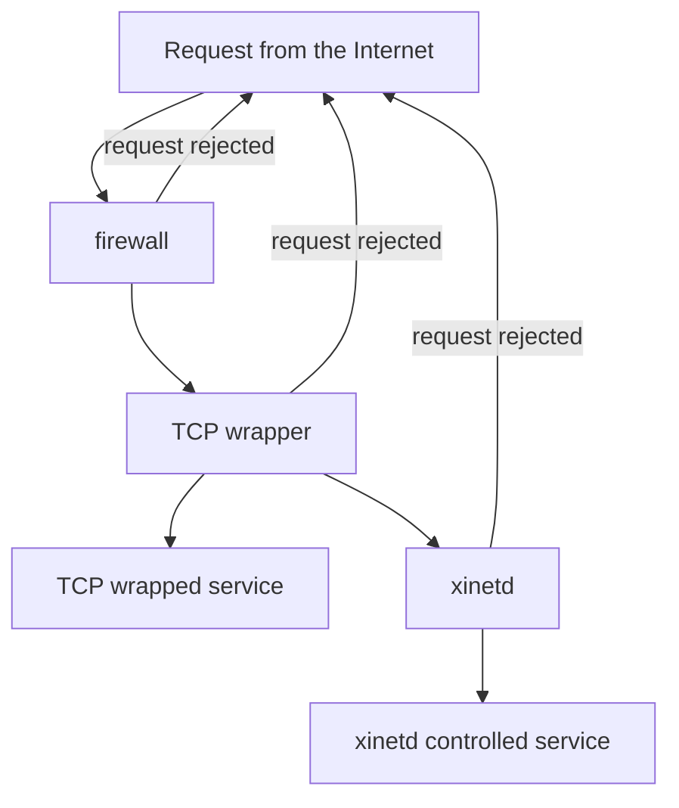

# Setup host security

**Introduction**

&nbsp; &nbsp; In this section, we shall be introduced to basic tips to adopt in order to improve on host security. And on this path of our journey, we shall explore interesting checkpoints like:
1. Scanning open ports in local and remote servers(computers), understanding associated services and checking and disactivaiting unnecessary services.
1. Using superdaemons to to manage services.
1. Very brief hover on TCP wrappers.
   
&nbsp; &nbsp; &nbsp; &nbsp;**OKAY.. Let's get started :grin:**
#### 
#### I. Scanning open ports in local and remote servers(computers), understanding associated services and checking services for unnecessary daemons.
***i. Scanning open ports in local and remote servers(computers).***

To come about this task, linux provides with tools such as: `lsof`, `fuser`, `netstat` and `nmap`
* *Using `fuser`*:
  
&nbsp; &nbsp; &nbsp; &nbsp; The command `fuser` or 'file user' provides information about what processes are accessing what files...
The output may be difficult to interprete without the `-v` switch(for verbose) as seeen below:
```bash
bash:~$ sudo fuser .
/home/ubuntu:         2837c  4021c  4176c  4177c
bash:~$ sudo fuser -v .
               USER        PID ACCESS COMMAND
bash:~$        ubuntu     2837 ..c.. bash
               ubuntu     4021 ..c.. bash
               root       4179 ..c.. sudo
               root       4180 ..c.. sudo
```
```bash
bash:~$ sudo fuser 22/tcp  -v
        USER        PID ACCESS COMMAND
22/tcp: root          1 F.... systemd
        root       1868 F.... sshd
```
The resultsl are self explainatory, but let's talk about the ACCESS culumn, here are the type of access:
- c:  Current directory.
- e: Executable being run.
- f: Open file (omitted in default display mode).
- F: Open file for writing (omitted in default display mode).
- r: root directory.

* *Using `lsof`*:
  
&nbsp; &nbsp; &nbsp; &nbsp;It stands for “list open files”. It has many switches to deal with different file types and usecases such as: `-u` for specified user, `-c` for files opened by a particular process name, `-P` for process id or port number... But we'll mostly use the `-i` for  listing information about open Internet sockets.
Running the following will list all open files in the computer system.

```bash
 bash:~$ lsof -i
```

A specific host can be specified with the @ip-address notation to check for its connections:
> Prerequisites:
- ssh access
- root priviledges
```bash
 bash:~$ ssh <user-name>@[<remote-host-name> || <host's-ip-address>] 'lsof /path/to/directory'
```
A specific port can equally be specified
```bash
 bash:~$ sudo lsof -i :<port-number>
```
- *using `netstat` and `ss`*
  
&nbsp; &nbsp; &nbsp; &nbsp; They basically perform the same tasks, with `ss` being a more recent version of `netstat`
They can take switches like: `-l` for listening, `-t` for tcp, `-u` for udp, `-e` for additional informatio, `-n` for port number and ip addreses, and more.
eg: scanning for TCP and UDP ports providing only the ip addresses and port numbers will take the following form:
```bash
bash:~$ ss -tuna
bash:~$ netstat -tuna
Active Internet connections (servers and established)
Proto Recv-Q Send-Q Local Address           Foreign Address         State
tcp        0      0 127.0.0.54:53           0.0.0.0:*               LISTEN
tcp        0      0 127.0.0.53:53           0.0.0.0:*               LISTEN
tcp6       0      0 :::22                   :::*                    LISTEN
tcp6       0      0 192.168.64.10:22        192.168.64.1:49673      ESTABLISHED
tcp6       0      0 192.168.64.10:22        192.168.64.1:52210      ESTABLISHED
tcp6       0      0 192.168.64.10:22        192.168.64.1:49169      ESTABLISHED
udp        0      0 127.0.0.54:53           0.0.0.0:*
udp        0      0 127.0.0.53:53           0.0.0.0:*
udp        0      0 192.168.64.10:68        0.0.0.0:*
```
let's interprete the obtained results:
* On line 2, we can summarize the obtained results as: A TCPv4 socket is listening on all available network interfaces (not just localhost) on port 53 (typically used for DNS) and will accept incoming connections on any port number.
 This is likely a DNS server running on the local machine, listening for requests from both local processes and potentially remote clients.
* And on lineThere is a TCPv6 connection established between two hosts, i.e. :
Local host (192.168.64.10) on port 22 (SSH) and Remote host (192.168.64.1) on port 52210(custum port). The connection is established, and data can be sent in both directions.

> Using nmap(network mapper)
- To scan our local device:
```bash
bash:~$ nmap localhost
```

- Scanning for port range in remote server
```bash
bash:~$ nmap -p <port-range> <remote-server-ip>
```
We can equally scan: multiple hosts(by separating them by spaces (e.g.: nmap localhost 192.168.1.7)). 
Host ranges (by using a dash (e.g.: nmap 192.168.1.3-20)).
Subnets (by using a wildcards (e.g.:   192.168.0.*)).
* Scanning for particular ports
```bash
bash:~$ nmap -p 22,80 localhost
```
- Scanning for port range in remote server
```bash
bash:~$ nmap -p <port-range> <remote-server-ip>
```

#### II. Using superdaemons(super servers) to to manage services.

&nbsp; &nbsp; &nbsp; &nbsp; It is a deamon running for security and resource management purposes. It listens to requests it is configured for annd starts the target services when needed to answer requests. In other words, it registers all the required services to itself making sure to map the arriving services to the corresponding services
&nbsp; &nbsp; &nbsp; &nbsp; Due to limmitted computational capabilities in the past, running system services as standalone processes wasn't feasible.. So this superdaemon had to listen to incoming network and start the appropriate services on demand. 
&nbsp; &nbsp; &nbsp; &nbsp; This adds a layer of security to the communication system and lets other services be inactive when not needed. Examples include `inetd` and `xinetd`(newer version of inetd)
Few linux distros use superdaemons like xinetd but some installations or traces of it may be found in /etc/xinetd. On current systems based on systemd the `systemd.socket` unit can be used in a similar way.

We shall use ssh as an exmple along side the systemd.socket to demonstrate the role of superdaemons
> prerequisites
- openssh-server and xinetd should be installed
- sshd should be running(can be verified with ``systemctl status sshd`` and ``systemctl status ssh``)
- ssh should be listening to its standard network port 22.(exercise for listeners)
- The local host's public keys should be among the list of known keys of the remote host
Finally the ssh service should be stopped (with sudo systemctl stop sshd.service)
The xinetd configuration file `/etc/xinetd.d/ssh` created with the configurations
```bash  
  service ssh {
      disable     = no
      socket_type = stream
      protocol    = tcp
      wait        = no
      user        = root
      server      = /usr/sbin/sshd
      server_args = -i # arguments to be passed to the xinentd server, meaning inetd compatible mode
  }
```
  Restart the xinetd service with:
```bash
bash:~$  sudo systemctl restart xinetd.service
```
  Check which service is listening now for incoming SSH connections.
Now you just have to start the SSH socket unit:
sudo systemctl start ssh.socket OR sudo systemctl start ssh.socket


#### IV. TCP Wrappers

These are tools that controls acces to network services bassed on the the source of incomming connections.
In times when firewalls were not available, TCP wrapperswere used to secure network connection into a host. 
This adds an additional layer of protection by defininng which hosts are allowed or not allowed to connect to a wrapped service.
Here's a simple illustration of the fact:

Configurations on this are done in the `/etc/hosts.allow` and `/etc/hosts.deny`
The `/etc/hosts.allow` allows to map services to IP addresses and explicitly identify IP addresses, hostnames, or domains that are allowed access to a machine.
Meaning only ip addreses included in this file are allowed to acces the machine in which they are configured.
And the reverse is true for `/etc/hosts.deny`.

***ii. Checking services for unnecessary daemons***
> For security reasons, as well as to control system resources, it is important to have an overview of what services are running. Unnecessary and unused services should be disabled.
As this may provide potential attack surfaces for unethical hackers.

These can be checked with commands usch as:
```bash
bash:~$ sudo service --status-all
```
And disabled with:
```bash
 bash:~$ sudo systemctl disable <service-name> --now
```
