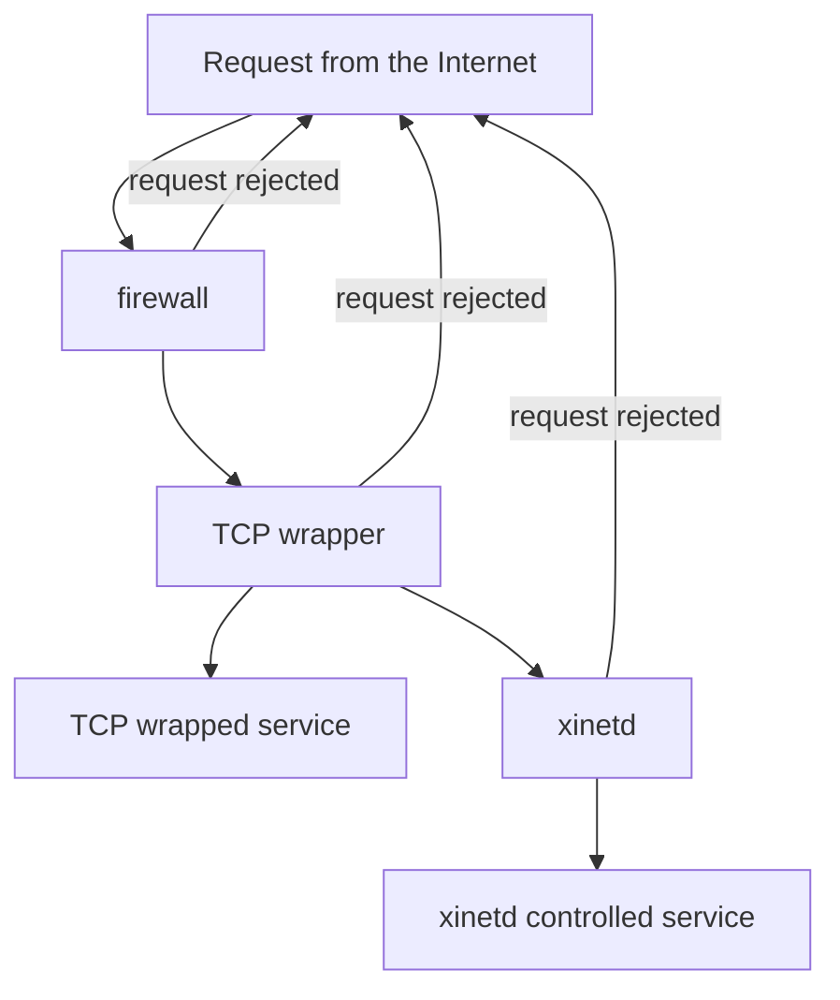

# Setup host security

**Introduction**
In this section, we shall be introduced to basic tips to adopt in order to improve on host security. And on this path of our journey, we shall explore interesting checkpoints like:
1. Basic commands and configuration settings to improve authentication security.(Already covered in Adiministrative tasks)
1. Scanning open ports in local and remote servers(computers), understanding associated services and checking and disactivaiting unnecessary services.
1. Using superdaemons to to manage services.
1. Very brief hover on TCP wrappers.
&nbsp; &nbsp; &nbsp; &nbsp;**OKAY.. Let's get started :grin:**
#### I. Basic commands and configuration settings to improve authentication security with shadow passwords.
&nbsp; &nbsp; &nbsp; &nbsp; In the FHS, the ``/etc/passwd`` directory is responsible for storing basic information about all user accounts. This file contains seven fields: login name, userid, groupid, password, comment (aka GECOS: optionally included for newly created users and could simply be a name), home directory location and finally the default shell.
&nbsp; &nbsp; Commands such as:
* passwd and chage (basically performs the same operations),
* usermod and useradd,
* adduser.
Shall briefly be covered under this section(for deeper understanding, refer to Administrative tasks)


 ***i. Using passwd and chage***

- Display the password status:
```bash
 bash:~$ sudo chage -l <user-name> || sudo passwd -S <user-name>
```

- Setting minimum number of days between password change
```bash
 bash:~$ sudo passwd -n <number-of-days> <user-name> || sudo passwd -m <number-of-days> <user-name>
```

- Setting maximum number of days between password change
```bash
 bash:~$ sudo passwd -x <number-of-days> <user-name> || sudo passwd -M <number-of-days> <user-name>
```

- Locking a user account 
```bash
 bash:~$ sudo passwd -l <user-name>
```

- Unlock a user account 
```bash
 bash:~$ sudo passwd -u <user-name>
```

- Setting an account's expiration date(say to 2024-11-26):
```bash
 bash:~$ sudo chage -E 2022-11-26 <user-name> || sudo passwd -e <user-name> # effect is immidiate
```

- Changing a user password:
```bash
 bash:~$ sudo passwd <user-name>
```

- Deleting a password
```bash
 bash:~$ sudo passwd -d <user-name>
 ```


***ii. Using useradd and usermod*** 

 - setting OR resetting expiration date
 ```bash
 bash:~$ sudo usermod -e <user-name> || sudo useradd -e <user-name>
 ```

 - set OR change login shell
 ```bash
  bash:~$ sudo useradd -s /path/to/shell <user-name> || sudo usermod -s /path/to/shell <user-name> 
  ```

  - set(upon creation) OR change the primary group of a user
  ```bash
  bash:~$ sudo useradd -g <group-name> <user-name> || sudo useradd -g <group-name> <user-name>
  ```

  - add a user to a group
  ```bash
  bash:~$ sudo useradd -aG <group-name> <user-name> || sudo useradd -aG <group-name> <user-name>
  ```

***iii.  using adduser(basically does the same things as useradd but with a more interactive interface and less features)***

- adding a new user
```bash
 bash:~$ sudo adduser <user-name>
 Adding user `<user-name>' ...
Adding new group `<user-name>' (<default-group-id>) ...
Adding new user `<user-name>' (<default-user-id>) with group `<user-name>' ...
Creating home directory `/home/<user-name>' ...
Copying files from `/etc/skel' ...
New password:
Retype new password:
passwd: password updated successfully
Changing the user information for john
Enter the new value, or press ENTER for the default
	Full Name []:
	Room Number []:
	Work Phone []:
	Home Phone []:
	Other []:
Is the information correct? [Y/n]
 ```

 - Adding a user to a group
 ```bash
 bash:~$ sudo adduser <user-name> <group-name>
Adding user '<user-name>' to group `<group-name>' ...
Adding user <user-name> to group <group-name>
Done.
```
#### II. Scanning open ports in local and remote servers(computers), understanding associated services and checking services for unnecessary daemons.
***i. Scanning open ports in local and remote servers(computers).***

To come about this task, linux provides with tools such as: `lsof`, `fuser`, `netstat` and `nmap`
* using `lsof`: It stands for “list open files”. It has many switches to deal with different file types and usecases such as: `-u` for specified user, `-c` for files opened by a particular process name, `-P` for process id or prt number... But we'll mostly use the `-i` for  listing information about open Internet sockets.
Running the following will list all open files in the computer system.

```bash
 bash:~$ lsof -i
```

A specific host can be specified with the @ip-address notation to check for its connections:
> Prerequisites:
- ssh access
- root priviledges
```bash
 bash:~$ ssh <user-name>@[ <remote-host-name> || <host's-ip-address> ] 'lsof /path/to/directory'
```
A specific port can equally be specified
```bash
 bash:~$ lsof -i :<port-number>
```
using `netstat` and `ss`
They basically perform the same tasks, with `ss` being a more recent version of `netstat`
they can take switches like
`-l` for listening, `-t` for tcp, `-u` for udp, `-e` for additional informatio, `-n` for port number and ip addreses, and more.
eg: scanning for listening tcp and upd ports with additional information will take the following form
```bash
bash:~$ ss -lute
carol@debian:~$ netstat -lute
Active Internet connections (only servers) 
Proto Recv-Q Send-Q     Local  Address      Foreign Address     State   User
Inode
tcp        0            0 0.0.0.0:ssh          0.0.0.0:*        LISTEN  root
13729
tcp        0            0 localhost:smtp       0.0.0.0:*        LISTEN  root

14372
tcp6       0            0 [::]:http            [::]:*           LISTEN  root

14159
tcp6       0            0 [::]:ssh             [::]:*           LISTEN  root

13740
tcp6       0            0 localhost:smtp       [::]:*           LISTEN  root

14374
udp        0            0 0.0.0.0:bootpc       0.0.0.0:*         LISTEN root
```
> Using nmap(network mapper)
- To scan our local device:
```bash
nmap localhost
```
We can equally scan: multiple hosts(by separating them by spaces (e.g.: nmap localhost 192.168.1.7)). 
host ranges (by using a dash (e.g.: nmap 192.168.1.3-20)).
subnets (by using a wildcards (e.g.:   192.168.0.*)).
* Scanning for particular ports
```bash
bash:~$ nmap -p 22,80 localhost
```
- Scanning for port range in remote server
```bash
bash:~$ nmap -p <port-range> <remote-server-ip>
```

#### III. Using superdaemons(super servers) to to manage services.
&nbsp; &nbsp; &nbsp; &nbsp; It is a deamon running for security and resource management purposes. It listens to requests it is configured for annd starts the target services when needed to answer requests. In other words, it registers all the required services to itself making sure to map the arriving services to the corresponding services
&nbsp; &nbsp; &nbsp; &nbsp; Due to limmitted computational capabilities in the past, running system services as standalone processes wasn't feasible.. So this superdaemon had to listen to incoming network and start the appropriate services on demand. 
&nbsp; &nbsp; &nbsp; &nbsp; This adds a layer of security to the communication system and lets other services be inactive when not needed. Examples include `inetd` and `xinetd`(newer version of inetd)
Few linux distros use superdaemons like xinetd but some installations or traces of it may be found in /etc/xinetd. On current systems based on systemd the `systemd.socket` unit can be used in a similar way.
<!-- 
we shall use ssh as an exmple along side the systemd.socket to demonstrate the role of superdaemons
> prerequisites
- openssh-server and xinetd should be installed
- sshd should bee running(can be verified with ``systemctl status sshd`` and ``systemctl status ssh``)
- ssh should be listening to its standard network port 22.(exercise for listeners)
Finally stop the SSH service (with sudo systemctl stop sshd.service)
The xinetd configuration file `/etc/xinetd.d/ssh` created with the configurations
  service ssh {
      disable     = no
      socket_type = stream
      protocol    = tcp
      wait        = no
      user        = root
      server      = /usr/sbin/sshd
      server_args = -i
      flags       = IPv4
      interface   = 192.168.178.1
  }
  Restart the xinetd service with:
  sudo systemctl restart xinetd.service
  Check which service is listening now for incoming SSH connections.
Now you just have to start the SSH socket unit:
sudo systemctl start ssh.socket OR sudo systemctl start ssh.socket
 -->

#### IV. TCP Wrappers
These are tools that controls acces to network services bassed on the the source of incomming connections.
In times when firewalls were not available, TCP wrapperswere used to secure network connection into a host. 
This adds an additional layer of protection by defininng which hosts are allowed or not allowed to connect to a wrapped service.
Here's a simple illustration of the fact:


***ii. Checking services for unnecessary daemons***
> For security reasons, as well as to control system resources, it is important to have an overview of what services are running. Unnecessary and unused services should be disabled.
As this may provide potential attack surfaces for unethical hackers.

These can be checked with commands usch as:
```bash
bash:~$ sudo service --status-all
```
And disabled with:
```bash
 bash:~$ sudo systemctl disable <service-name> --now
```

#### Limits on Users computer  resources
This is mainly conncerned with the management of system resources is especially important when dealing with a system having multiple users.
These limits can be described as `soft(S)` or `hard(H)` and are managed with `ulimit`.
The `-a` flag can be used to list all resources, i.e.

```bash
bash:~$ ulimit -a # for both soft and hard limits
real-time non-blocking time  (microseconds, -R) unlimited
core file size              (blocks, -c) 0
data seg size               (kbytes, -d) unlimited
scheduling priority                 (-e) 0
file size                   (blocks, -f) unlimited
pending signals                     (-i) 15468
max locked memory           (kbytes, -l) 499960
max memory size             (kbytes, -m) unlimited
open files                          (-n) 1024
pipe size                (512 bytes, -p) 8
POSIX message queues         (bytes, -q) 819200
real-time priority                  (-r) 0
stack size                  (kbytes, -s) 8192
cpu time                   (seconds, -t) unlimited
max user processes                  (-u) 15468
virtual memory              (kbytes, -v) unlimited
file locks                          (-x) unlimited

bash:~$ ulimit -Sa # for soft limits
bash:~$ ulimit -Ha #for hard limits
```
With the above output, a particular resource can then be accessed and manipulated using it's corresponding switch. 
Example: Modifying the cpu time will make use of the corresponding `-t` switch as such:

```bash
bash:~$ ulimit -t 16 # time in seconds
```

> NOTE: If the limit is set without precising whether it is soft or hard, it is taken as default to be both.
The `-St` switch may be used for softlimit and `-Ht` for hard limit

#### Dealing with Logged in User
This done with commands like: `w`, `who`, `last`
* `who` and `w` on their own are commands used to display the list of currently logged in users
`who` supports additional flags such as: `-r` to diplay the current runlevel, `-b`to display the time of last system boot
* `last` prints a listing of the last logged in users with the most recent information on top. To check for bad login attempts, run `lastb` or `last -b` instead of last.

